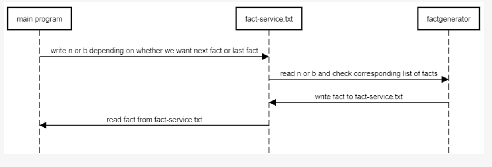

To request a fact from the microservice: 
write 'n' to fact-service.txt

to request the last fact:
write 'b'

to exit:
write 'X' (it does not erase the X from the file though)

to receive the facts, simply read them from the microservice!

if you want to add or remove facts, simply add them to facts.txt (before you open the microservice) separated by a newline

Facts are from:
https://www.lowermybills.com/learn/buying-a-home/surprising-facts-about-buying-a-home/
If you want to add more or take some out, just make sure each fact in facts.txt is on its own line in the file.

took the following out so the video would be less than 5 minutes:
18. You Can Buy a Home If You Have No Credit
19. You Can Buy a Home If You Have Student Loan Debt
20. About Two-Thirds of Americans Own Their Home
21. Most Homebuyers Use a Real Estate Agent
22. 71% of Homebuyers Only Interview One Agent
23. 90% of Buyers Would Recommend Their Agent
24. A 7% Interest Rate Is Lower Than Average Historically
25. Most People Buy a Home To Be a Homeowner
26. The Mortgage Isn’t Your Only Ongoing Housing Expense
27. 79% of Homebuyers Buy Detached Single-Family Homes
28. Most Buyers Choose Previously Owned Homes
29. Most Homes Purchased Are in the Suburbs
30. Location Is More Important Than Size
31. 22% of Homebuyers Prioritized Proximity to Family and Friends
32. Older Homebuyers Move Farther Than Younger Buyers
33. Most Buyers Want a Home That’s the Same Size or Larger
34. The Average Home Is 1,860 Square Feet
35. The Average Home Has 3 Bedrooms and 2 Bathrooms
36. Fewer Homebuyers Want Carpeting
37. Half of Homebuyers Want a Fenced-In Backyard
38. The Living Room Can Make or Break a Home
39. Finding the Right Property Is the Most Difficult Part
40. Most Buyers Find a Home Through an Online Search
41. It Takes an Average of 10 Weeks To Find a Home
42. Homebuyers View an Average of 7 Homes
43. More Than 700,000 Homes Are on the Market
44. You Can Negotiate the Purchase Price
45. Buyers Typically Pay 100% of Asking Price
46. 45% of New Homebuyers Want To Avoid Renovations
47. Paying a Mortgage Can Improve Your Credit
48. 28% of Homebuyers Say They Plan Never To Move
49. Even First-Time Homebuyers Plan To Stay Put for a While
